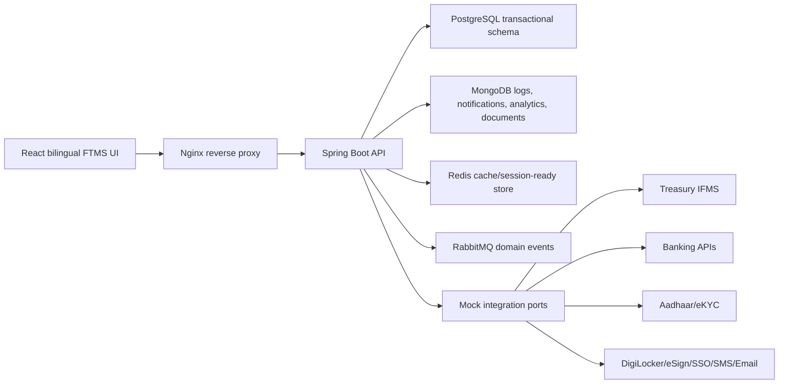
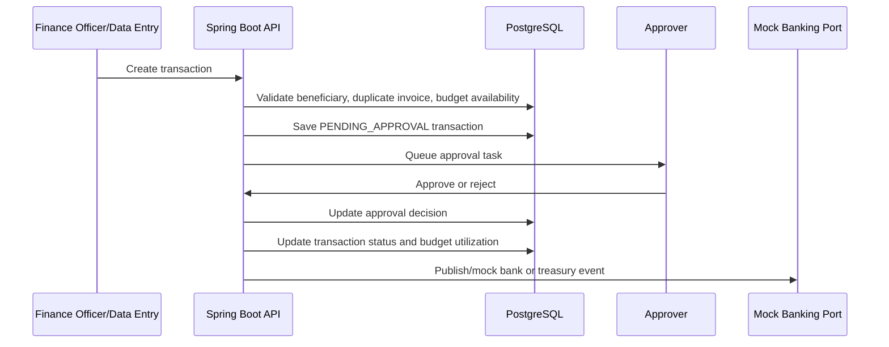
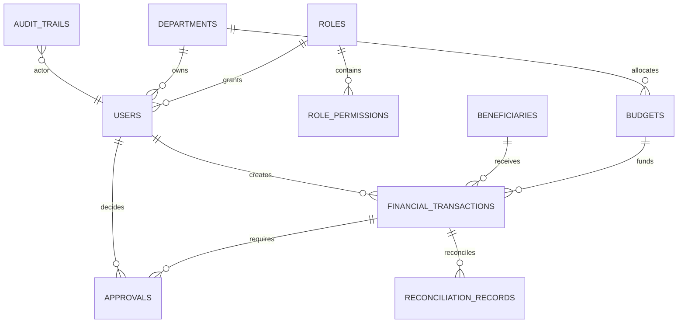

# Architecture

## System View

## Transaction Lifecycle

## Core ERD

## Clean Architecture Shape

- `domain`: JPA and Mongo domain models
- `repository`: Spring Data persistence interfaces
- `service`: business rules, audit, reports, auth
- `controller`: REST API layer
- `security`: JWT and Spring Security configuration
- `integration`: mock implementations for external government systems
- `events`: in-memory and RabbitMQ domain event publishers

